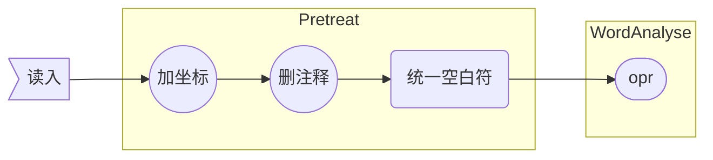
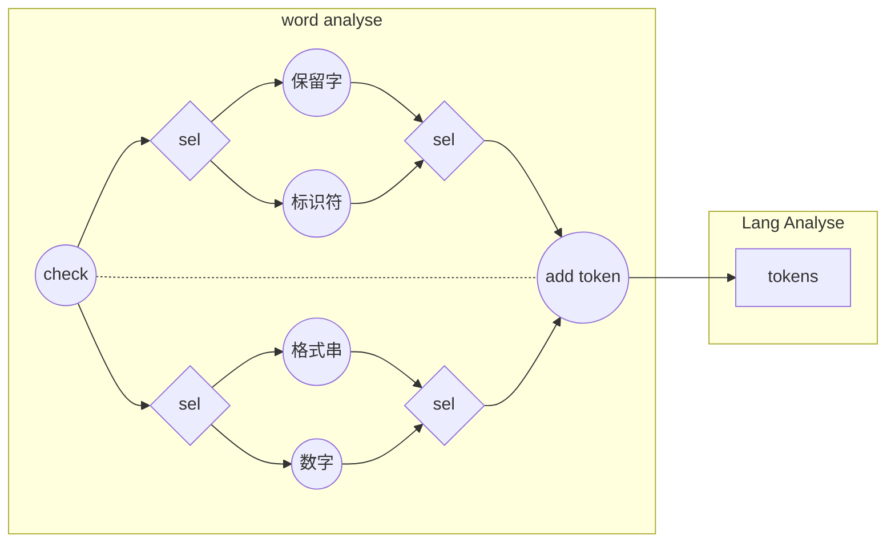

## 前端

### 预处理与文件I/O

文件读写被单独抽象成一个类。

+ 读入：为每个字符添加坐标信息，删注释、将空白符统一转为空格，传给词法分析器。
+ 输出：接受输出`String`输出到目标文件

### 词法分析

词法分析器运行单独的`一遍`，将文件IO类传入的原始输入转换为`token`序列，并将`token`序列整体传入语法分析器。

+ 保留字：使用`Trie`树识别
+ 标识符、格式串、数字：手写识别函数

### 语法分析

语法分析器首先由词法分析器传入的`token`序列建立`AST`，然后在此基础上填符号表、驱动中间代码生成。

+ `AST`的所有节点均继承自一个`Node`抽象类，这个抽象类提供了诸如访问`token`序列、输出语法成分等功能，定义了推导语法、填符号表、生成中间代码等功能函数。
+ 对`token`序列的访问是通过一个辅助类`Cusor`实现的。由于`Cusor`直接接触`token`序列，报错功能也经由它实现。
+ 语法分析器是整个前端的核心，它总共运行`三遍`，分别是建立AST、填符号表、生成中间代码。都是通过AST的根节点`CompUnit`递归调用功能函数实现的。出错处理在前两遍中完成。

### 文法定义

我对官方文法作了一些改动，使之更适合递归下降方法，同时也更简洁，因此有必要单独介绍我使用的文法，以及我如何识别官方文法中的语法成分。

+ 广义左值：我把所有形如`ident`、`ident[...]...`、`ident(...)`的语法成分统一定义为广义左值，避免了因变量和函数在前缀部分完全相同导致的回溯。
+ 表达式的扩展巴科斯范式：我把表达式的文法改成扩展巴科斯范式，避免了左递归。
+ 同步：`AST`上的每个节点在语法推导结束后标记自身的成分类型，并对自己的子节点打成分标签，实现与官方文法的同步。
+ 单层回溯：推导`LVal '=' Exp ';'`和`Exp ';'`规则时不可避免地会出现`LVal`含义的冲突问题，解决方法是先推导广义左值，然后检查等号是否出现，若没有等号则会滚至`LVa`推导前的状态，推导表达式。

### 符号表

分别实现了全局和局部变量表，局部变量表实现了栈式符号表。

+ `AST`中`Block`节点会创建新的局部符号表，在子节点填表前压栈，之后弹栈。
+ 查局部变量表时递归查找，创建新变量时只查询当前的局部变量表。
+ 变量用单独的`Var`类维护相关信息，包括是否常量、数组维度、数值。

### 中间代码

#### 数值

`?` 代表一个变量，这意味着查找对应数值将遇到困难，或许能用时间戳解决？因此SSA是有意义的

记录中间结果，然后懒操作赋值语句

`val` = `?` + c, `?` * c, `?` / c, +c, !!`?`, --`?`

`?` + c + d => `?` + (c + d)

`?` * c * d => `?` * (c * d)

`?` / c / d => `?` / (c * d)

!!`?` => `?`

--`?` => `?`

x[0] = -x[0];	x01: -x00

y = -x[0];		y1  : -x01 => x00

x[0] = -x[0];	x02: -x01 => x00

x[0] = -x[0];	x03: -x02 => -x00

$\phi$ x[0] <= x03, y <= y1

x03 <= -x00

y1 <= x00

sw x03 => x[0]

sw y1 => y

#### 跳转

空`if`、`else`、`while`块

函数调用
