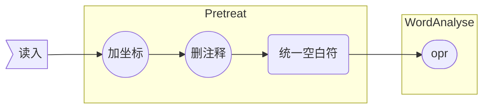
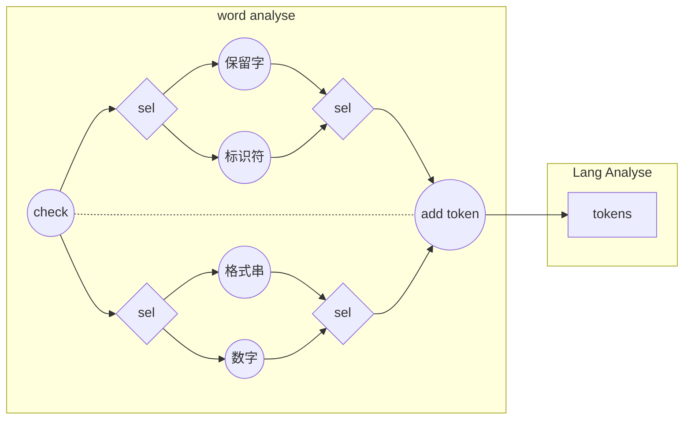

# 设计文档

JCC，用java编写的SYSY编译器

## 总述

整体架构分为词法分析`word`、语法分析`lex`、语义分析与生成中间代码`meta`、翻译和优化引擎`engine`四部分，其中，符号表和错误处理在`meta`中实现。

由于采用原生SSA的路线，后端的整体架构较为合理。

## 前端

前端在后端编写过程中没有改动。

### 预处理与文件I/O

文件读写被单独抽象成一个类。

+ 读入：为每个字符添加坐标信息，删注释、将空白符统一转为空格，传给词法分析器。
+ 输出：接受输出`String`输出到目标文件

### 词法分析

词法分析器运行单独的`一遍`，将文件IO类传入的原始输入转换为`token`序列，并将`token`序列整体传入语法分析器。

+ 保留字：使用`Trie`树识别
+ 标识符、格式串、数字：手写识别函数

### 语法分析

语法分析器首先由词法分析器传入的`token`序列建立`AST`，然后在此基础上填符号表、驱动中间代码生成。

+ `AST`的所有节点均继承自一个`Node`抽象类，这个抽象类提供了诸如访问`token`序列、输出语法成分等功能，定义了推导语法、填符号表、生成中间代码等功能函数。
+ 对`token`序列的访问是通过一个辅助类`Cusor`实现的。由于`Cusor`直接接触`token`序列，报错功能也经由它实现。
+ 语法分析器是整个前端的核心，它总共运行`三遍`，分别是建立AST、填符号表、生成中间代码。都是通过AST的根节点`CompUnit`递归调用功能函数实现的。出错处理在前两遍中完成。

#### _Node抽象类_

`Node`是整个语法分析器的核心，它定义了三个基本功能函数——forward(), logIdt(), translate()，分别用于语法分析和建立AST，填错误处理符号表以及生成原始中间代码。

+ forward() 函数是递归下降法的具体实现形式，通过读`Cursor`接受输入字符串，并据此从工厂中创建新的`Node`对象，建立语法树。
+ logIdt() 是早期为错误处理对符号表的需求单独添加的函数，围绕它进行的一系列设计实现了错误处理所需的类型检查功能，此后由于时间紧张，这些代码并没有被转移到生成中间代码的过程中，而是得到了保留。
+ translate() 是从AST导出中间代码的函数，`Node`中的原始定义实际上只能覆盖大部分情形的翻译需求。我为了实现一些特殊的语法成分的翻译，还编写了一些特殊的translate() 方法

#### 文法定义

我对官方文法作了一些改动，使之更适合递归下降方法，同时也更简洁，因此有必要单独介绍我使用的文法，以及我如何识别官方文法中的语法成分。

+ 广义左值：我把所有形如`ident`、`ident[...]...`、`ident(...)`的语法成分统一定义为广义左值，避免了因变量和函数在前缀部分完全相同导致的回溯。
+ 表达式的扩展巴科斯范式：我把表达式的文法改成扩展巴科斯范式，避免了左递归。
+ 同步：`AST`上的每个节点在语法推导结束后标记自身的成分类型，并对自己的子节点打成分标签，实现与官方文法的同步。
+ 单层回溯：推导`LVal '=' Exp ';'`和`Exp ';'`规则时不可避免地会出现`LVal`含义的冲突问题，解决方法是先推导广义左值，然后检查等号是否出现，若没有等号则会滚至`LVa`推导前的状态，推导表达式。

### 错误处理

由于语法分析器使用了工厂模式，调用方和工厂创建的对象互相不知道对方的内部结构，数据传递的局限性非常大，因此我在编写错误处理时遇到了困难。实际的解决方式是给符号表增加buffer，通过额外的全局辅助记忆搞定数据传递。

整个处理机制是：先在语法分析过程中记录每个节点上的信息，并且处理`语法错误`；接着通过递归调用 logIdt() 函数遍历语法树，通过填、查符号表处理`语义错误`。在两个过程中都维护`Cusor`的内部状态，并且每发现一个错误，立即报给`Cusor`，由`Cusor`生成错误类别码和错误位置。

#### _buffered符号表_

分别实现了全局和局部变量表，局部变量表为栈式符号表。每个表中都有buffer。

+ buffer是一个Buf对象，提供了name、cnst、onDecl、paramCnt、paramErr等public属性，供树上的`Node`对象写入和查询

+ `AST`中`Block`节点会创建新的局部符号表，在子节点填表前压栈，之后弹栈。
+ 查局部变量表时递归查找，创建新变量时只查询当前的局部变量表。
+ 变量用单独的`Var`类维护相关信息，包括是否常量、数组维度、数值。

## 后端

由于原生SSA，整个优化过程中整体架构没有发生很大变动。

### 符号体系

源程序中的普通变量并不被看作是变量，四元式才被看作变量，而源程序中的这些变量值被当作某个四元式的标识符。四元式和目标代码是整个后端尺度最小的两个基本单位，由于mips汇编语句也是四元式，因此整个后端也可以看成是具有两层中间代码。

#### _Meta_

中间代码被命名为`Meta	`，意为它是描述整个程序的元语言，在符号体系中占首要地位。

基本的`Meta`类定义了查找前驱、查找等价式、检查是否是常量、翻译、取出结果等功能，具体的中间代码类则均是通过继承`Meta`类再重写一些方法来实现。

#### _MIdt_

中间符号记作`MIdt`，它被实现为接口而非对象，且只要求提供Typ和Name，这给具体符号的实现留下了较大发挥空间。

+ `MVar` ：用来记录变量符号的类，记录是否常量、是否为参数、是否为全局变量；记录初值和数组模板；记录类型和名称
  1. 把数组的第二维强制向上取到2的幂，使得寻址代码用移位替代乘法
  2. (后期新增) 对于参数中的数组，绑定一个特殊phi节点，降低访存开销
+ `MFunc`：用来记录函数符号的类，记录类型和名称；记录参数表等信息
  1. 额外维护函数写入哪些全局变量
  2. 额外维护函数读取哪些全局变量
  3. 额外维护函数使用哪些寄存器
  4. 以上三点用于最小化函数调用时需要保护的现场
+ `MStr`：记录字符串常量，没啥好说的

#### _MTable_

以名字为单位的栈式符号表，给每个名字开栈，查询时只用查栈顶，实现了$\mathcal O(1)$查询，在插入时维护插入记录，因此也实现了$\mathcal O(1)$插入与回滚。

### SSA

从最开始就是原生SSA，所以没有普通四元式与SSA的互转。SSA的生成与优化流程

### 寄存器分配

以函数为单位，分配时做了随机映射以减小函数调用时的寄存器冲突，但这也造成了性能不稳定。
