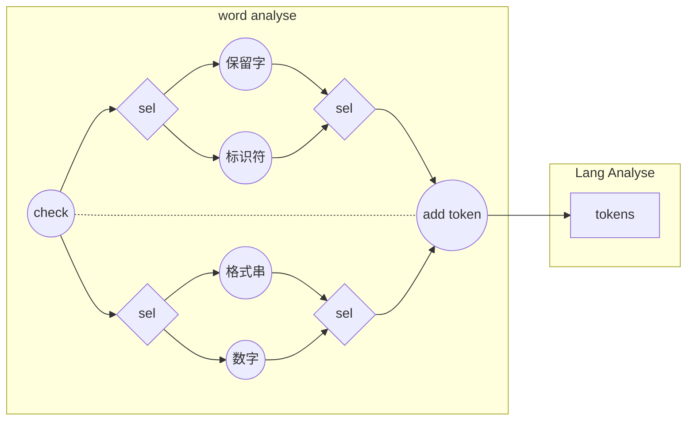

# 设计文档

JCC，用java编写的SYSY编译器

## 总述

整体架构分为词法分析`word`、语法分析`lex`、语义分析与生成中间代码`meta`、翻译和优化引擎`engine`四部分，其中，符号表和错误处理在`meta`中实现。

由于采用原生SSA的路线，后端的整体架构较为合理。

## 前端

前端在后端编写过程中没有改动。

### 预处理与文件I/O

文件读写被单独抽象成一个类。

+ 读入：为每个字符添加坐标信息，删注释、将空白符统一转为空格，传给词法分析器。
+ 输出：接受输出`String`输出到目标文件

### 词法分析

词法分析器运行单独的`一遍`，将文件IO类传入的原始输入转换为`token`序列，并将`token`序列整体传入语法分析器。

+ 保留字：使用`Trie`树识别
+ 标识符、格式串、数字：手写识别函数

### 语法分析

语法分析器首先由词法分析器传入的`token`序列建立`AST`，然后在此基础上填符号表、驱动中间代码生成。

+ `AST`的所有节点均继承自一个`Node`抽象类，这个抽象类提供了诸如访问`token`序列、输出语法成分等功能，定义了推导语法、填符号表、生成中间代码等功能函数。
+ 对`token`序列的访问是通过一个辅助类`Cusor`实现的。由于`Cusor`直接接触`token`序列，报错功能也经由它实现。
+ 语法分析器是整个前端的核心，它总共运行`三遍`，分别是建立AST、填符号表、生成中间代码。都是通过AST的根节点`CompUnit`递归调用功能函数实现的。出错处理在前两遍中完成。

#### _Node抽象类_

`Node`是整个语法分析器的核心，它定义了三个基本功能函数——forward(), logIdt(), translate()，分别用于语法分析和建立AST，填错误处理符号表以及生成原始中间代码。

+ forward() 函数是递归下降法的具体实现形式，通过读`Cursor`接受输入字符串，并据此从工厂中创建新的`Node`对象，建立语法树。
+ logIdt() 是早期为错误处理对符号表的需求单独添加的函数，围绕它进行的一系列设计实现了错误处理所需的类型检查功能，此后由于时间紧张，这些代码并没有被转移到生成中间代码的过程中，而是得到了保留。
+ translate() 是从AST导出中间代码的函数，`Node`中的原始定义实际上只能覆盖大部分情形的翻译需求。我为了实现一些特殊的语法成分的翻译，还编写了一些特殊的translate() 方法

#### 文法定义

我对官方文法作了一些改动，使之更适合递归下降方法，同时也更简洁，因此有必要单独介绍我使用的文法，以及我如何识别官方文法中的语法成分。

+ 广义左值：我把所有形如`ident`、`ident[...]...`、`ident(...)`的语法成分统一定义为广义左值，避免了因变量和函数在前缀部分完全相同导致的回溯。
+ 表达式的扩展巴科斯范式：我把表达式的文法改成扩展巴科斯范式，避免了左递归。
+ 同步：`AST`上的每个节点在语法推导结束后标记自身的成分类型，并对自己的子节点打成分标签，实现与官方文法的同步。
+ 单层回溯：推导`LVal '=' Exp ';'`和`Exp ';'`规则时不可避免地会出现`LVal`含义的冲突问题，解决方法是先推导广义左值，然后检查等号是否出现，若没有等号则会滚至`LVa`推导前的状态，推导表达式。

### 错误处理

由于语法分析器使用了工厂模式，调用方和工厂创建的对象互相不知道对方的内部结构，数据传递的局限性非常大，因此我在编写错误处理时遇到了困难。实际的解决方式是给符号表增加buffer，通过额外的全局辅助记忆搞定数据传递。

整个处理机制是：先在语法分析过程中记录每个节点上的信息，并且处理`语法错误`；接着通过递归调用 logIdt() 函数遍历语法树，通过填、查符号表处理`语义错误`。在两个过程中都维护`Cusor`的内部状态，并且每发现一个错误，立即报给`Cusor`，由`Cusor`生成错误类别码和错误位置。

#### _buffered符号表_

分别实现了全局和局部变量表，局部变量表为栈式符号表。每个表中都有buffer。

+ buffer是一个Buf对象，提供了name、cnst、onDecl、paramCnt、paramErr等public属性，供树上的`Node`对象写入和查询

+ `AST`中`Block`节点会创建新的局部符号表，在子节点填表前压栈，之后弹栈。
+ 查局部变量表时递归查找，创建新变量时只查询当前的局部变量表。
+ 变量用单独的`Var`类维护相关信息，包括是否常量、数组维度、数值。

## 后端

由于原生SSA，整个优化过程中整体架构没有发生很大变动。

### 符号体系

源程序中的普通变量并不被看作是变量，四元式才被看作变量，而源程序中的这些变量值被当作某个四元式的标识符。四元式和目标代码是整个后端尺度最小的两个基本单位，由于mips汇编语句也是四元式，因此整个后端也可以看成是具有两层中间代码。

#### _Meta_

中间代码被命名为`Meta	`，意为它是描述整个程序的元语言，在符号体系中占首要地位。

基本的`Meta`类定义了查找前驱、查找等价式、检查是否是常量、翻译、取出结果等功能，具体的中间代码类则均是通过继承`Meta`类再重写一些方法来实现。

#### _MIdt_

中间符号记作`MIdt`，它被实现为接口而非对象，且只要求提供Typ和Name，这给具体符号的实现留下了较大发挥空间。

+ `MVar` ：用来记录变量符号的类，记录是否常量、是否为参数、是否为全局变量；记录初值和数组模板；记录类型和名称
  1. 把数组的第二维强制向上取到2的幂，使得寻址代码用移位替代乘法
  2. (后期新增) 对于参数中的数组，绑定一个特殊phi节点，降低访存开销
+ `MFunc`：用来记录函数符号的类，记录类型和名称；记录参数表等信息
  1. 额外维护函数写入哪些全局变量
  2. 额外维护函数读取哪些全局变量
  3. 额外维护函数使用哪些寄存器
  4. 以上三点用于最小化函数调用时需要保护的现场
+ `MStr`：记录字符串常量，没啥好说的

#### _MTable_

以名字为单位的栈式符号表，给每个名字开栈，查询时只用查栈顶，实现了$\mathcal O(1)$查询，在插入时维护插入记录，因此也实现了$\mathcal O(1)$插入与回滚。

### 中间代码

从最开始就是原生SSA，所以没有普通四元式与SSA的互转。

如前所述，四元式是基本单位，一条四元式被看作一个量，源代码中的变量不过是标识符而已。这个做法的优点在于，原生块内复写优化。

#### _标识码与指针_

每个四元式有一个id，一个legend值，一个equals指针

1. `id`每个四元式的唯一标识
2. `legend`根据id和后继指令的`legend`值求出，用来确定每条四元式的相对位置，维护好后，可以直接排序得到拓扑序
3. `equals`如果某四元式与另一四元式等价，那么就把`equals`指针指向它。显然这形成了一个并查集，可以通过路径压缩实现等效指令的快速查找。这样，删除无用四元式就十分方便

#### _基本块_

使用三个类来存放一个基本块，分别是

1. 块头类`SyncR`，用phi节点记录基本块需要从外部读入哪些变量；
2. 块尾类`SyncO`，维护一个map，记录基本块更新了哪些变量的值；
3. 块体类`SyncB`，记录基本块中有哪些中间代码。

这里所说的变量特指源代码中的变量。

#### _全局变量_

开辟一个特殊基本块来存放全局变量，这个基本块只有头`GlobalR`和尾`GlobalO`，没有块体。函数内访问全局变量时将`GLobalO`中存放的特殊四元式作为phi节点的前驱；写全局变量时把`GLobalR`中存放的特殊phi节点看作后继。

#### _SSA生成与优化_

SSA的生成与优化流程如下：

1. 从语法树导出每个基本块内的SSA，顺便建好数据流图
2. （优化）常量传播和公共子表达式删除
3. （优化）跑tarjan，求流图的强连通分量
4. 做定义-使用分析，得到1中生成的每个phi节点有哪几个前驱
5. 迭代消除前驱数量为1的phi节点
6. （优化）从一定产生结果的语句出发，逐步迭代得到所有有效代码，强连通分量中只要有一个块有效，则全有效。优化部分后面有更详细的介绍
7. 做死代码抠除
8. 做寄存器分配
9. 生成目标代码

### 目标代码

目标代码仍然以多态的方式作为对象存储，而不直接生成字符串。由于存储的形式仍有一定的抽象，可以在目标代码上做窥孔优化比较容易。

#### _存储方式_

以双链表的形式存储。基类中提供前驱/后继指针和相应的维护代码，通过构造方法中的相关代码实现了创建对象时自动加入链表。

### 基本功能的具体实现

#### _数据流分析_

是的，优化前是$\mathcal O(n)$数据流，后化后改成了$\mathcal O(n^2)$数据流。

+ $\mathcal O(n)$ 数据流分析：

  不考虑break和continue以及goto的存在的话，由于循环只能从一个确定的分支语句退出，因而数据流图是一个仙人掌，这使得可以采用如下做法实现$\mathcal O(n)$数据流分析：

  > 1. 把循环的回边标记为轻边，其他边标记为重边
  > 2. 在重边的拓扑序上跑两遍迭代

  这个做法看起来非常美丽，似乎也可以简化数据结构的设计。然而实践表明，这个设计几乎是一切bug的原点，我调通这个做法用了一个星期以上，然而修改为$\mathcal O(n^2)$做法调通只用了一个晚上。

  所以我的评价是：华而不实且浪费大量时间。

  由于break和continue的加入使得数据流图不再是仙人掌，这个做法的正确性遭到破坏，需要额外的补救措施。然而事实上支持break和continue就已经十分困难，理论上也不可能支持goto。同时为保证拓扑序而出现的大量代码显著增加了bug

  总之，写了这个做法，我极其后悔

+ $\mathcal O (n^2)$ 数据流分析：

  真香

  用set替代arraylist，这样就可以允许重复插入，再让每个函数返回是否迭代成功的信息即可，注意到每个基本块的出度之多为2，所以这个图非常不满，因而即便这样一搞会变成$\mathcal O(n^2\log n)$也仍然跑得飞快。

#### _phi节点的实际翻译_

+ **伪SSA**（极早期）可以在基本块结束时把所有变量都写回到栈或全局变量区上，这样phi节点只要从内存读回来即可，缺点是处理一个phi节点需要两条访存指令，效率低下。我本来打算先这样实现，但后来由于受到某佬的感召，痛下决心实现了真SSA。

+ **$\psi$节点的引入**

  对于phi节点本身而言，显然只需要为其分配寄存器即可，然而这还远远不够，还需要解决前驱基本块如何把数据写入到phi的寄存器中的问题。我的做法是维护每个基本块中各个变量的位置，并在出口处为每个去向翻译出一系列$\psi$节点。

  $\psi$节点的功能是：接受一个输入，把输入写进目标四元式的寄存器/栈空间中。

  这样，在翻译基本块末尾的跳转语句时，预先根据目标基本块的块头确定有哪些phi节点需要处理，生成对应的$\psi$节点，传给跳转语句。跳转语句的实际翻译过程是：先跳到对应的$\psi$节点区，接着翻译$\psi$节点，再跳到目标基本块，完成对phi节点的处理。

+ **基环外向树** 

  $\psi$节点区的整体行为显然是对变量的位置做重新分配。将每个变量重配前/后的地址连有向边，不难发现，由于每个点的入度至多为1，最终会形成一个基环外向树森林。环的存在导致不能直接在拓扑序上翻译重配代码。

  我的做法是先找环，然后在翻译时插入一个临时寄存器解决分配问题。同时还要严格遵守寄存器->栈，寄存器->寄存器，栈->寄存器的顺序。

#### _活跃变量维护_

+ return语句和IO语句一定有效，继而逆向推导其他有效语句。显然对于一个有效语句，它用到的前驱语句也是有效的，据此可以得到每个四元式的活跃时间。推导到每个四元式，就把它从活跃变量表中删掉。

  上述做法是对的，因为SSA导出的冲突图是弦图。

+ （优化）注意到有些基本块可能是无效的，因此不该假设跳转语句一定有效，只有存在多出口且去往不同的有效块时才有效。

#### _函数调用的实现_

+ **伪内联** 把调用的函数看作特殊基本块，按正常方式处理，同时回写修改过的全局变量、保护将被覆盖的寄存器，函数返回后恢复寄存器，取回继续使用的全局变量。
+ （优化前）按伪SSA的方式传参
+ （优化）按真SSA的方式传参，同时参数参与寄存器分配

### 优化

SSA自身的优良特性使得进行各种优化都比较容易，然而由于时间限制，完整版常量传播没时间写了，有些遗憾。

#### _寄存器分配_

从SSA导出的冲突图是弦图，意味着可以用最大势算法得到理论最小染色。

以函数为单位，先跑最大势算法，然后根据每种颜色的着色次数倒序分配寄存器，最后再把寄存器号random_shuffle一下，降低不同函数使用寄存器的重合度，不过shuffle的效果在一些测试点上不是特别稳定。

#### _死代码抠除_

既然维护了活跃变量，那么抠除从未活跃过的变量(四元式)自然就完成了死代码抠除

#### 常量除法

注意到$a/b = ab^{-1}$，做整数除法时可以取$a(2^Nb^{-1})>>n$，从而将除法换成乘法。

> 设$a = Xb+R,\ 0\le R<b$，$\phi=\lceil 2^M/b \rceil,\ r=\phi - 2^M/b$.
$$
\begin{align}
a\phi &= (Xb + R)(2^M/b + r)\\
&= 2^MX + ar + 2^MR/b
\end{align}
$$

这将产生 $ar + 2^MR/b$ 的误差，因此要求

> $0\le ar + 2^MR/b < 2^M \Leftrightarrow 0\le rab < (b-R)2^M$ 

注意到$0\le r<1,\ 0\le R \le b-1$，放缩后有

> $ab<2^M \Rightarrow M=31+\lceil \log b\rceil $

这时可用$a\phi>>M$替代$a/b$ 。但是注意到爆int的问题，这时可以取$\phi'=\phi/2,\ \phi''=\phi\%2$，拆成两步乘法，使用 mthi、mtlo 处理$\phi''$的贡献，然后使用madd计算$a\phi'$。

至于取模，只要计算出$X$然后取$R=a-Xb$即可。

至于负数，考虑到算数右移不总是等于除2，因此要特判处理。

| tf1    | tf2       | tf3        | tf4      | tf5      | tf6      |
| ------ | --------- | ---------- | -------- | -------- | -------- |
| 218875 | 2646337.5 | 73304426.5 | 311848.5 | 520773.5 | 200745.5 |

#### _消除无效跳转(窥孔)_

删除跳到PC+4的跳转，合并连续的跳转

| tf1      | tf2     | tf3        | tf4    | tf5      | tf6      |
| -------- | ------- | ---------- | ------ | -------- | -------- |
| 172023.5 | 2644836 | 64879101.5 | 284688 | 490880.5 | 180052.5 |

（同时还有常量传播）
#### _常量传播&复写优化_

+ **DAG** 常量比较值，变量比较id

| tf1      | tf2     | tf3        | tf4    | tf5      | tf6      |
| -------- | ------- | ---------- | ------ | -------- | -------- |
| 172013.5 | 2644839 | 64879123.5 | 284688 | 481025.5 | 180092.5 |

+ **DAST** DAG+AST，没时间了

#### _死代码抠除+_

跑tarjan求流图中的强连通分量，认为IO语句、写全局变量的语句、写数组的语句有效，认为有多出口的强连通分量有效，认为有效语句的前驱有效，认为含有效语句的强连通分量有效，反复迭代，确定所有有效的强连通分量。删去无效的强连通分量，但保留其中向分量外跳转的语句。

| tf1  | tf2     | tf3        | tf4      | tf5    | tf6      |
| ---- | ------- | ---------- | -------- | ------ | -------- |
| 245  | 2644836 | 64876923.5 | 284685.5 | 475603 | 180158.5 |

#### _参数传递(伪内联+)_

将函数调用视为进入特殊基本块，参数重配与进入普通基本块完全类似。

| tf1  | tf2      | tf3        | tf4      | tf5      | tf6      |
| ---- | -------- | ---------- | -------- | -------- | -------- |
| 211  | 769316.5 | 64876923.5 | 202720.5 | 383382.5 | 152045.5 |

#### _取消ra保护_

对于不调用其他函数的纯函数，取消将ra值写入栈的操作

| tf1  | tf2      | tf3        | tf4      | tf5      | tf6      |
| ---- | -------- | ---------- | -------- | -------- | :------- |
| 221  | 769311.5 | 64876593.5 | 202721.5 | 307354.5 | 151565.5 |
