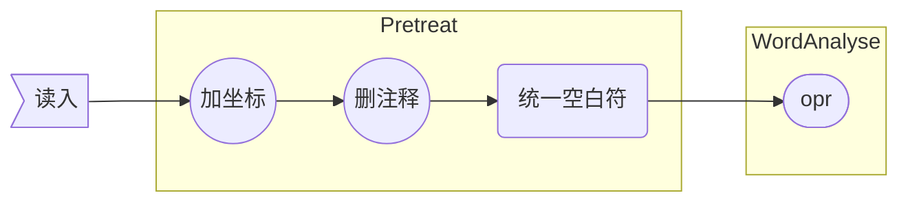
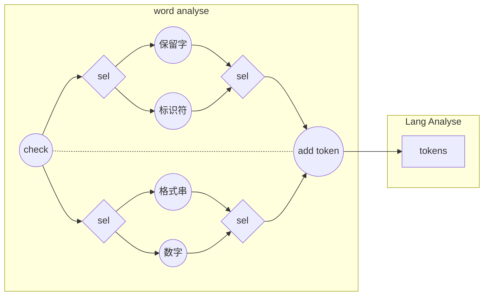

# 词法分析文档

## 预处理与文件I/O

将文件读写单独抽象成一个类，

类型：枚举类

保留字：Trie树

流程：读入，为每个字符添加坐标信息，删注释、将空白符统一转为空格，传给词法分析器，

```mermaid
graph LR
	0>读入] --> 11((加坐标))
	subgraph Pretreat
		11 --> 12((删注释))
    12 --> 13(统一空白符)
	end
	13 --> opr([opr])
	subgraph WordAnalyse
	opr
	end
	
```

## 词法分析

```mermaid
graph LR
subgraph word analyse
		21((check)) --> 211{sel} & 212{sel}
		211 --> 22((保留字)) & 23((标识符)) 
		212 --> 24((格式串)) & 25((数字))
		
		22 & 23 --> 261{sel}
		24 & 25 --> 262{sel}
		261 --> 26
		21 -.- 26
		262 --> 26((add token))
	end
	26 --> 27[tokens]
	subgraph Lang Analyse
	27
	end
```

